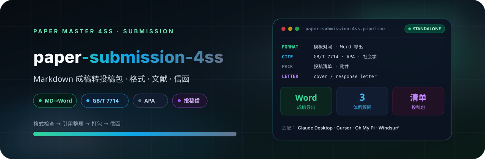

<p align="center">
  
</p>

# Paper 投稿整备 4SS

中文社会科学论文投稿文件整备模块。用于将 Markdown 成稿导出为 Word，按用户模板或内置社会学研究范式模板检查格式，整理正文引用与文后参考文献，生成投稿清单、cover letter 与 response letter。

## 4SS 家族

| 包 | 职责 |
|---|---|
| [paper-master-4ss](https://github.com/JingYangYuan/paper-master-4ss) | 总控：登记输入、选择模块、维护工作区 |
| [paper-design-4ss](https://github.com/JingYangYuan/paper-design-4ss) | 选题、框架路由、研究设计蓝图 |
| [paper-lit-4ss](https://github.com/JingYangYuan/paper-lit-4ss) | 中英文检索、文献地图、空白与假设 |
| [paper-outline-4ss](https://github.com/JingYangYuan/paper-outline-4ss) | 素材转大纲、证据映射、缺口报告 |
| [paper-analysis-4ss](https://github.com/JingYangYuan/paper-analysis-4ss) | 定量 / 质性 / 混合，Stata · R · Python |
| [paper-write-4ss](https://github.com/JingYangYuan/paper-write-4ss) | 章节写作、润色、语言扫描、正文净稿 |
| [paper-check-4ss](https://github.com/JingYangYuan/paper-check-4ss) | 全文审稿、质量门控与精确回流 |
| **[paper-submission-4ss](https://github.com/JingYangYuan/paper-submission-4ss)**（本仓库） | Word 导出、体例、投稿清单与信函 |
| [paper-update-4ss](https://github.com/JingYangYuan/paper-update-4ss) | 待审核更新包，不直接改核心文件 |

## 它做什么

把接近完成的 Markdown 成稿转成投稿包：Word 导出、格式对照、正文引用与文后参考文献整理、投稿清单、cover letter 与 response letter。

不负责大规模重写正文。论证或证据问题回流 [`paper-check-4ss`](https://github.com/JingYangYuan/paper-check-4ss) 清单指向的模块；语言扫描残留回流 write。Word 导出依赖 pandoc。默认读取最新 `paper-check-report-*`；总体结论为「不建议当前投稿」或「大修后复审」时不导出 Word，除非用户显式覆盖。

## 安装

将本目录放到宿主的 skill 目录。入口见 `SKILL.md`。

```bash
git clone https://github.com/JingYangYuan/paper-submission-4ss.git
```

与 [`paper-master-4ss`](https://github.com/JingYangYuan/paper-master-4ss) 同级安装时，跨模块路径才能解析。只做本模块任务也可以单独使用。

## 与总控的关系

本包由总控 [`paper-master-4ss`](https://github.com/JingYangYuan/paper-master-4ss) 导出；对应源目录是总控包内的 `modules/submission/`：

- 包内相对路径相对本包根目录解析
- `master/` 与部分 `references/` 是导出时的协议快照
- 更新方式：修改总控任一模块、家族表、路由或协议后，必须无参数重新导出**全部**独立包并 push 全部 GitHub 仓；不要只改本仓库，也不要只导出改过的那一个。

## License

[MIT](LICENSE)
